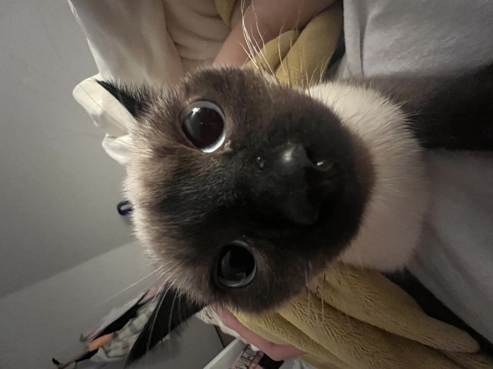
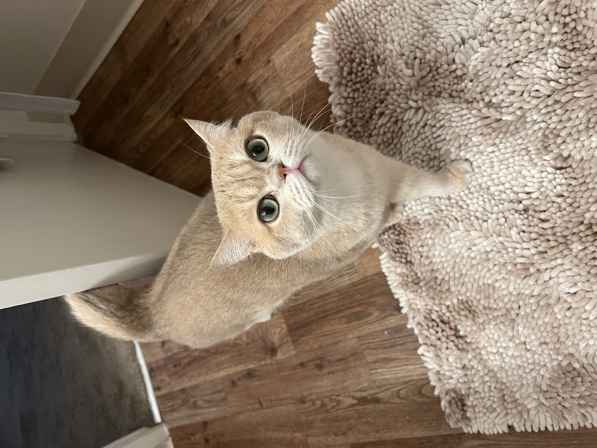

## Yue Yin's page
I have two cats, they are **Tutu** and **Xixi**.
 
 
[Both of them](WechatIMG460.jpeg)

During my freetime, I like watching movies. The recently movies I have watched are 
>Finding Nemo, Harry Potter, etc.

Also, I have other activities could do in free time, they are
1. golf
2. hang out with friend
3. painting
4. play with my cat
5. watch youtube

### Related to programming, I have some tips for wirite a PA.
+ Use `gdb` command help debug the code. If you need [help with gdb](https://www.tutorialspoint.com/gnu_debugger/gdb_commands.htm). Here is it.
+ Write down the information stored in the varaible by hand to track the information.
+ Draw graph before write the code

The following is just the list make sure I have everything in this website:
- [x] PIctures
- [x] Headings
- [x] Quoting text
- [x] Quoting code
- [x] External Links
- [x] Section links
- [x] Relative links
- [x] Ordered and Unordered Lists
- [x] Task lists

